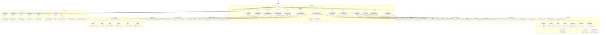

```mermaid
flowchart TD;
    Start((Start)) -->|Navigate| HomePage[Home Page]
    
    subgraph Main Pages
        HomePage -->|View Articles| ArticlePage[Article Page]
        HomePage -->|Authenticate| UserAuth[User Authentication]
        HomePage -->|Dashboard| UserDashboard[User Dashboard]
        HomePage -->|Write & Edit| ContentEditor[Writing & Editing]
        HomePage -->|Admin Panel| AdminPanel[Admin Panel]
        HomePage -->|Search| SearchSystem[Search & Filtering]
        HomePage -->|Notifications| Notifications[Notifications]
        HomePage -->|SEO| SEO[SEO Optimization]
        HomePage -->|Security| Security[Performance & Security]
        HomePage -->|API| APIIntegration[API Integration]
        HomePage -->|Subscriptions| Subscriptions[Subscription Model]
        HomePage -->|Comments| Comments[Comment System]
        HomePage -->|Responsive Design| ResponsiveUI[Mobile Responsiveness]
    end
    
    subgraph User Management
        UserAuth -->|Login| Login[Login]
        UserAuth -->|Signup| Signup[Signup]
        UserAuth -->|OAuth| OAuth[OAuth Integration]
        UserDashboard -->|Profile| Profile[Profile Management]
        UserDashboard -->|Saved Articles| Saved[Saved Articles]
        UserDashboard -->|History| History[Reading History]
    end
    
    subgraph Content Management
        ContentEditor -->|Editor| Editor[Rich Text Editor]
        ContentEditor -->|Markdown| Markdown[Markdown Support]
        ContentEditor -->|Images| Images[Upload Images]
        ContentEditor -->|Drafts| Drafts[Save Drafts]
        AdminPanel -->|Users| ManageUsers[Manage Users]
        AdminPanel -->|Articles| ManageArticles[Manage Articles]
        AdminPanel -->|Categories| ManageCategories[Manage Categories]
    end
    
    subgraph Search & Filtering
        SearchSystem -->|Tags| Tags[Tag Filters]
        SearchSystem -->|Categories| Categories[Category Filters]
        SearchSystem -->|Authors| Authors[Author-Based Searches]
    end
    
    subgraph Notifications
        Notifications -->|Comments| RealTimeComments[Real-Time Comments]
        Notifications -->|Likes| Likes[Likes]
        Notifications -->|Mentions| Mentions[Mentions]
    end
    
    subgraph Security & Performance
        Security -->|Caching| Caching[Caching]
        Security -->|Lazy Loading| LazyLoading[Lazy Loading]
        Security -->|Rate Limiting| RateLimiting[Rate Limiting]
        Security -->|CSRF| CSRF[CSRF Protection]
    end
    
    subgraph API & Database
        APIIntegration -->|Fetch| Fetch[Data Fetching]
        APIIntegration -->|Operations| Operations[Backend Operations]
        APIIntegration -->|Endpoints| Endpoints[API Endpoints]
        Endpoints -->|Get Articles| GetArticles[Get Articles]
        Endpoints -->|Post Article| PostArticle[Post Article]
        Endpoints -->|Get User| GetUser[Get User]
        Endpoints -->|Post User| PostUser[Post User]
        Endpoints -->|Get Comments| GetComments[Get Comments]
        Endpoints -->|Post Comment| PostComment[Post Comment]
        Endpoints -->|Database Models| DBModels[Database Models]
        DBModels -->|Article Schema| ArticleSchema[Article Schema]
        DBModels -->|User Schema| UserSchema[User Schema]
        DBModels -->|Comment Schema| CommentSchema[Comment Schema]
    end
    
    subgraph Subscription & Comments
        Subscriptions -->|Exclusive Content| Exclusive[Exclusive Content]
        Comments -->|Nested| Nested[Nested Comments]
        Comments -->|Likes| CommentLikes[Likes]
        Comments -->|Replies| Replies[Reply Threads]
    end
    
    subgraph Responsiveness
        ResponsiveUI -->|Mobile| Mobile[Mobile Views]
        ResponsiveUI -->|Tablet| Tablet[Tablet Views]
    end
    
    subgraph SEO Strategies
        SEO -->|Strategies| SEOPlans[SEO Strategies]
        SEOPlans -->|Keywords| Keywords[Keyword Research]
        SEOPlans -->|On-Page| OnPage[On-Page SEO]
        SEOPlans -->|Off-Page| OffPage[Off-Page SEO]
        SEOPlans -->|Technical| Technical[Technical SEO]
        SEOPlans -->|Content| ContentSEO[Content Optimization]
        SEOPlans -->|Metadata| Metadata[Metadata Examples]
    end
    
    subgraph Page Structure
        HomePage -->|Page Content| PageContent[Page Content]
        PageContent -->|Navbar| Navbar[Navigation Bar]
        PageContent -->|Footer| Footer[Footer]
        PageContent -->|Main Content| MainContent[Home Content]
        ArticlePage -->|Content| ArticleContent[Article Content]
        UserDashboard -->|Dashboard Content| DashboardContent[User Dashboard Content]
    end
    
    subgraph Legal Pages
        HomePage -->|About| About[About Page]
        HomePage -->|Contact| Contact[Contact Page]
        HomePage -->|FAQ| FAQ[FAQ Page]
        HomePage -->|Terms| Terms[Terms & Conditions]
        HomePage -->|Privacy| Privacy[Privacy Policy]
        About -->|Content| AboutContent[About Content]
        Contact -->|Form| ContactForm[Contact Form]
        FAQ -->|Content| FAQContent[FAQ Content]
        Terms -->|Content| TermsContent[Terms Content]
        Privacy -->|Content| PrivacyContent[Privacy Content]
    end
```

